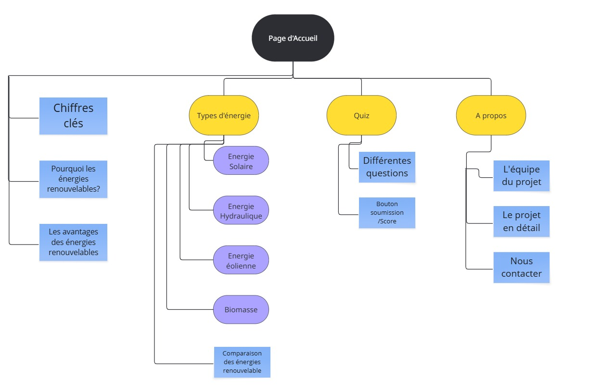

# 🌱 Projet Web – Énergies Renouvelables

## 🎯 Objectif du projet

Ce site web a été développé dans le cadre d’un projet universitaire. Il vise à sensibiliser les utilisateurs aux différentes sources d’énergies renouvelables à travers un contenu interactif, pédagogique et visuellement attractif.

---

## 🧩 Contenu du site

- **Accueil** : Introduction générale et chiffres clés.
- **À propos** : Présentation des membres du projet et de leurs contributions.
- **Types d’énergies** :
  - Solaire
  - Éolienne
  - Hydraulique
  - Biomasse (avec animation interactive)
- **Quiz** : Questionnaire pour tester les connaissances sur les énergies renouvelables.
- **Animations** : Interactions avec clics (ex : éolienne en rotation, vache, barrage...).

---

## 💻 Technologies utilisées

- HTML5
- CSS3 (animations, responsive design)
- JavaScript (DOM, événements, interactions utilisateur)
- Responsive Design (Media Queries)

---

## 📁 Arborescence simplifiée

---

## 👨‍🎓 Auteurs

Projet réalisé par **Lilian CAO et Batur Hamzogullari**  
dans le cadre de l’UE **TI402 – Programmation Web** (L2 – 2024/2025).

